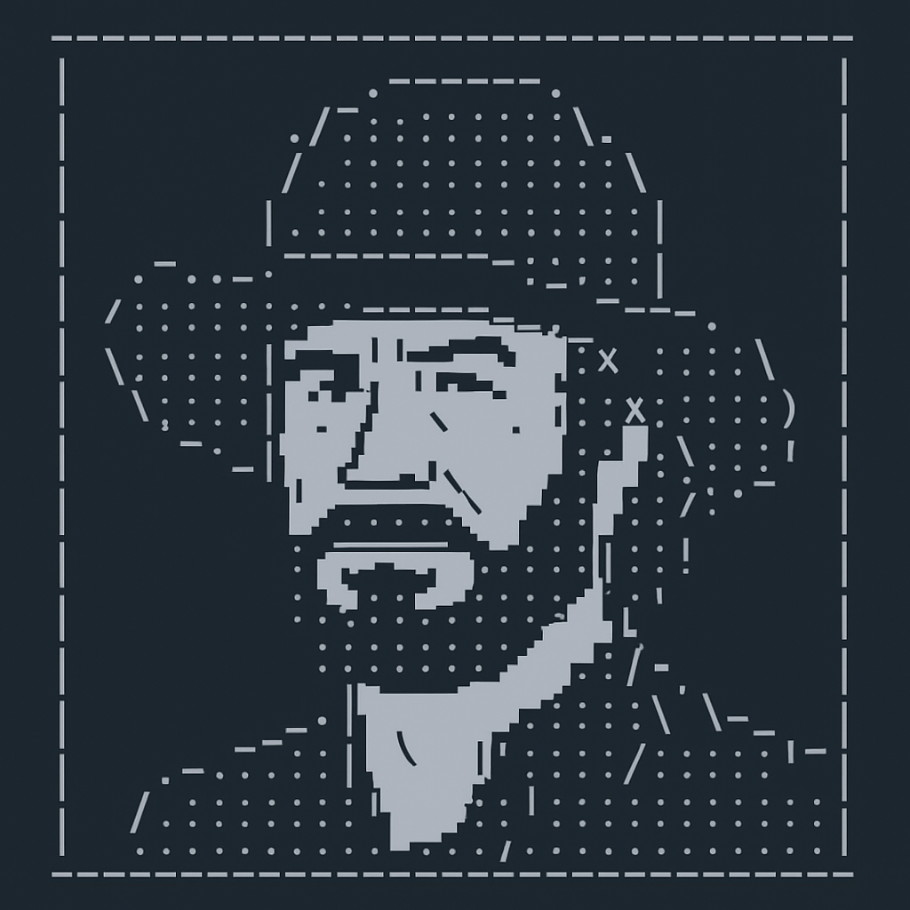

# ChuckNorris Facts – Déploiement Kubernetes sécurisé (CDS-ready)


> Chuck Norris n'a pas besoin de secrets. Les credentials s'auto-signent pour lui.



Ce projet propose un exemple complet de déploiement sécurisé d'une application Python minimaliste dans un cluster Kubernetes (K3s), avec Helm et une préparation CI/CD orientée GitOps et sécurité.

## Objectif

Mettre en place un workflow de déploiement sécurisé avec :
* Séparation des environnements dev et prod
* Utilisateurs Kubernetes restreints par certificats
* RBAC strict par namespace
* Helm chart factorisé
* Préparation d'une chaîne CI/CD via OVH CDS

## Stack utilisée

| Composant | Usage |
|-----------|-------|
| Python 3.12 | Application (générateur Chuck Norris) |
| Docker | Conteneurisation |
| K3s | Cluster Kubernetes local |
| Helm | Déploiement applicatif |
| Git | GitOps (dev, prod) |
| CDS (à venir) | CI/CD pipeline via OVH |

## Arborescence simplifiée

```
.
├── build/                  # Application Python + Dockerfile
├── charts/                 # Helm chart complet
│   ├── Chart.yaml
│   ├── templates/
│   ├── dev-values.yaml
│   └── prod-values.yaml
├── certificats/            # RBAC YAML uniquement (pas de clés)
│   ├── ovh-dev/
│   └── ovh-prod/
├── ca/                     # Certificat d'autorité public (non versionné)
└── .gitignore
```

## Sécurité & bonnes pratiques
* Aucun fichier .key, .crt, .kubeconfig n'est versionné
* RBAC strict et namespace isolé (dev, prod)
* PodSecurity Standard : restricted
* SecurityContext appliqué sur tous les workloads
* Images Docker taguées (1.0.0) – pas de latest en prod

### 🛰️ Intégration de Falco (Runtime Security)

Falco a été installé via Helm dans un namespace dédié (`falco`), avec :
- un déploiement en `DaemonSet`,
- un PodSecurity Standard restrictif (`restricted:latest`),
- la collecte de logs centralisée,
- la validation de son bon fonctionnement via `kubectl get pods` et `kubectl logs`.

Falco permet ici de démontrer une capacité à intégrer un agent de sécurité en temps réel dans un cluster Kubernetes, sans configuration poussée, mais avec une logique de production.

### Signature d’image Docker avec Cosign (Keyless)

Cosign a été intégré dans le pipeline CI/CD pour :
	•	signer automatiquement l’image Docker via --keyless,
	•	garantir l’intégrité et la traçabilité sans gestion de clé privée,
	•	vérifier publiquement la signature via cosign verify.

Cette signature cryptographique assure que l’image provient bien du pipeline validé, conforme aux bonnes pratiques DevSecOps GitOps.

## Déploiement (dev)

```bash
# Build de l'image
cd build
docker build -t <user>/chucknorris:1.0.0 .

# Push vers Docker Hub
docker push <user>/chucknorris:1.0.0

# Déploiement Helm dans le namespace dev
helm upgrade --install chuck-dev ./charts \
  -f charts/dev-values.yaml \
  --namespace dev
```

## Certificats & kubeconfigs

Les certificats et fichiers kubeconfig sont générés manuellement pour chaque utilisateur via un script local non inclus dans ce repo. Seuls les fichiers RBAC (Role / RoleBinding) sont présents à des fins d'exemple.

Voir certificats/README.md pour les explications.

## Pipeline CI/CD avec OVH CDS

Le projet intègre un pipeline CI/CD complet via OVH CDS (Continuous Delivery Service), configuré pour suivre les meilleures pratiques DevSecOps :

### Structure du pipeline

```
Dev Pipeline → Approbation Manuelle → Prod Pipeline
    │
    ├── 📊 Analyse statique (Bandit)
    ├── 📦 Scan des dépendances (pip-audit)
    ├── 🔧 Build d'image Docker (sécurisé)
    ├── 🔎 Scan de vulnérabilités (Trivy)
    ├── 🔏 Signature d'image (cosign)
    ├── 📋 Validation des charts Helm (kube-score)
    ├── 📦 Déploiement en dev (secure kubeconfig)
    └── 🕷️ Test de sécurité dynamique (ZAP)
```

### Mesures de sécurité implémentées

* **Shift-left security** : Détection des problèmes de sécurité au plus tôt dans le cycle 
* **Defense-in-depth** : Multiples couches de contrôles (code, dépendances, conteneur, configuration)
* **Runtime protection** : Analyse dynamique post-déploiement
* **Secret management** : Utilisation de Vault pour les credentials sensibles
* **Image signing** : Garantie de l'intégrité des images via signatures cryptographiques
* **Least privilege** : Contextes d'exécution réduits pour chaque étape

### Utilisation du pipeline

```bash
# Vérification locale de la syntaxe CDS
cdsctl workflow lint .cds.yaml

# Déploiement du workflow
cdsctl workflow push .cds.yaml

# Exécution manuelle du workflow
cdsctl workflow run chucknorris-secure-pipeline
```

Le pipeline suit un modèle GitOps où les changements sur la branche `dev` déclenchent automatiquement le workflow complet, avec validation manuelle requise avant le déploiement en production.

## À faire
* ✅ Intégration pipeline OVH CDS (cds.yaml)
* ✅ Ajout d'un scanner Trivy dans le workflow
* Ajout d'un ServiceAccount restreint pour les workloads 
* Ajout de tests automatisés basiques

## Licence

Projet démonstratif. Aucun secret réel ni donnée de prod n'est versionnée. Destiné à prouver la capacité à sécuriser un pipeline DevOps local avec K3s, Helm et GitOps.